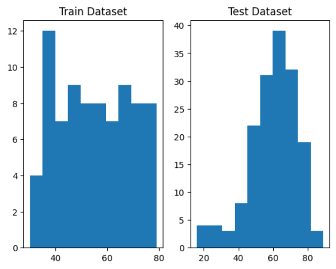
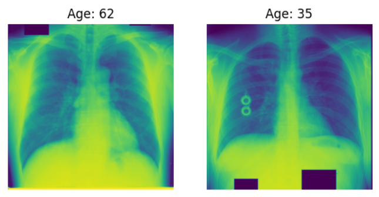

# Image Regression ChestXray Age Prediction

This repository uses the miniJSRT_database, which is a small dataset of Chest X-rays that can be used by those who would like to apply deep learning algorithms to a dataset. The dataset can ben found here: http://imgcom.jsrt.or.jp/minijsrtdb/

The aim of this project is to predict the age of the patient of the chest X-ray image. To perform this task, the Age dataset was used, which contains 245 pictures Chest X-ray images. Out of the 245 images available, 80 were used as part of the training dataset and 165 were used as part of the test dataset. This imbalance between the training and test datasets is unusual, but I decided to keep the data split provided from the dataset source. I also noticed that the training dataset has a wide range of ages, while the test dataset describes only a smaller range of the ages available. This can be seen in the histogram below:

Each picture is of size 2048x2048. A sample of a picture from each gender can be seen below.

The architecture used was Resnet18. I updated the number of output features of the final layer to have 1 output option for the age.

To train the model, I created data loaders of size 8 and I ran 100 epochs. The MAE of the test dataset is 11.12, which is considered high. However, due to the low quantity of images, making perfect predictions with this dataset is challenging.

## References
[1] http://db.jsrt.or.jp/eng.php

[2] http://imgcom.jsrt.or.jp/minijsrtdb/
